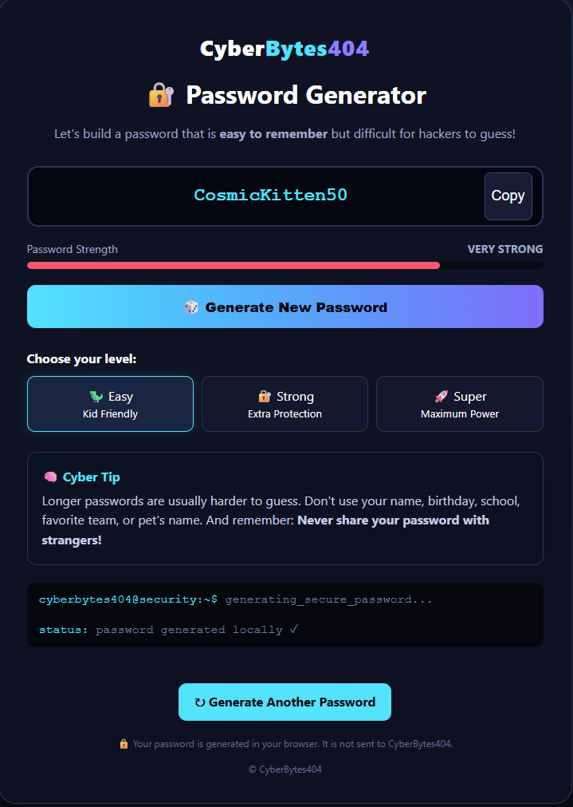

# 🔐 CyberBytes404 Web Password Generator

A simple, kid-friendly password generator created by **CyberBytes404** to help teach good password habits and basic cybersecurity concepts.

The generator creates passwords **locally in your web browser**. Generated passwords are not sent to or stored by CyberBytes404.



## 🚀 Try the Password Generator

### [Launch the CyberBytes404 Password Generator](https://cyb3rbytes404.github.io/Web-Password-Generator/)

## 🔑 Password Levels

The generator provides three password levels:

**🦖 Easy — Kid Friendly**
Creates an easy-to-remember password using words and numbers.

**🔐 Strong — Extra Protection**
Creates a longer password using multiple words, numbers, and a special character.

**🚀 Super — Maximum Power**
Creates an even longer password with multiple words, numbers, and special characters.

## 🧠 Cyber Safety Tips

A strong password should:

* Be long and difficult to guess
* Avoid your real name or birthday
* Avoid your school, favorite team, or pet's name
* Be different for each important account
* Never be shared with strangers

For important accounts, consider using a trusted password manager to create and store unique passwords.

## 🛡️ Privacy

Password generation happens directly in your browser.

The application does not require an account, database, or server to generate passwords.

## 💻 Technology

This project is intentionally lightweight and uses:

* HTML5
* CSS3
* JavaScript
* GitHub Pages

The entire password generator is contained in `index.html`.

## 📂 Repository Structure

```text
Web-Password-Generator/
├── index.html
└── README.md
```

## 🎓 About CyberBytes404

**CyberBytes404** is an educational project focused on helping kids and communities learn about cybersecurity, coding, electronics, and responsible technology use through approachable hands-on projects.

---

**CyberBytes404**
*Learn • Build • Explore • Stay Cyber Safe*
